# 1)

### `ls`
lists all unhidden contents within the current directory.

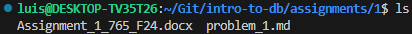
<br>

### `ls -l`
lists all contents with the long listing format.
long list format includes file name, permissions, size, and date modified.

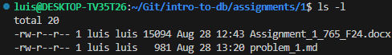
<br>

### `ls -a`
lists all unhidden and hidden contents within the current directory.

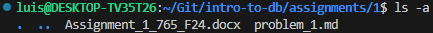
<br>

### `cd tests`
attempts to move to the "tests" directory, fails if "tests" does not exist.

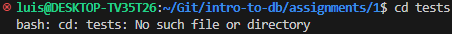
<br>

### `pwd`
prints the current directory.

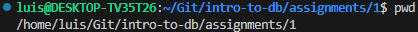
<br>

### `mkdir example_dir`
Creates a directory with the name "example_dir" if it doesn't already exist.

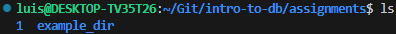
<br>

### `ls -al > out`
Runs the `ls` command with the "-a" and "-l" flags, then copies the output of that command to a file called "out".

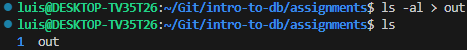
<br>

### `more out`
Views the file "out" within the termal, press q to stop viewing.

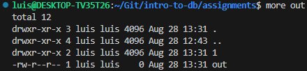
<br>

### `chmod a+w out`
Changes the access rights of the file "out" to allow all users to write to and delete it.

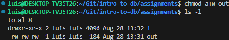
<br>

### `ls -al`
Runs the "ls" command with the "-a" and "-l" flags which lists all unhidden and hidden files with the long listing format.

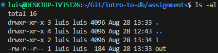
<br>

# 2)

### Code
```py
if __name__ == "__main__":
    usr_num = int(input("Please enter an integer: "))
    if usr_num < 0:
        raise ValueError("Invalid integer {}".format(usr_num))

    if usr_num == 0:
        answer = 1
    else:
        answer = usr_num
        for n in range(usr_num-1, 0, -1):
            answer *= n

    print("{}! = {}".format(usr_num, answer))
```
<br>

### Output
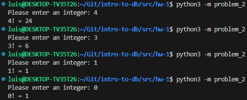
<br>
